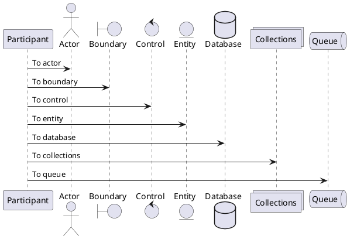
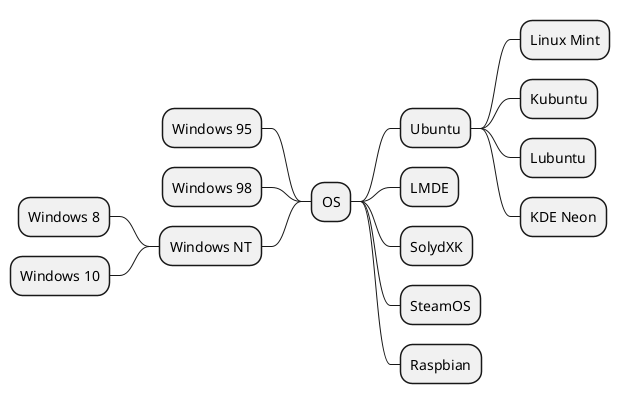

# Convert Markdown to HTML with Python

**Markdown-server** is a simple web application. It converts markdown file to HTML and response by text/html.

## Library Dependencies

|No.|Name|Description|
|:-|:-|:-|
|1|markdown|Convert Markdown -> HTML|
|2|pygments|Syntax highlighter|
|3|bottle|Web application framework|


## Syntax Highlight

```python
import markdown as md
import codecs
import sys
from env import *

class MarkdownConverter(object):

    def __init__(self):
        css = codecs.open(css_root + css_name,encoding=ms_encoding,mode='r')
        self.html_header = '''
            <html>
            <head>
            <style type='text/css'>
            <!--
            ''' + css.read() + \
            '''
            //-->
            </style>
            </head>
            <body>
            <div class='markdown-body'>
            '''
        self.html_footer = '''
            </div>
            </body>
            </html>
            '''

    def convert(self,src,dst=""):
        code = md.markdown(self.read_md(src), extensions=[markdown_type])
        return self.write_html(code,src,dst)

    def read_md(self,file_name):
        md_file = codecs.open(markdown_root + file_name,encoding=ms_encoding,mode='r')
        return md_file.read()

    def write_html(self,body,file_name,dst):
        html_path = html_root + file_name + html_extension

        if dst != "":
            html_path = dst

        html_file = codecs.open(html_path,encoding=ms_encoding,mode='w')
        html_file.write(self.html_header + body + self.html_footer)
        return html_path

def main():
    args = sys.argv
    if len(args) != 3:
        print('usage: convert source_md_file target_html_file')
    else:
        converter = MarkdownConverter()
        converter.convert(args[1],args[2])

if __name__ == '__main__':
    main()

```
- Sequence Diagram

- 


